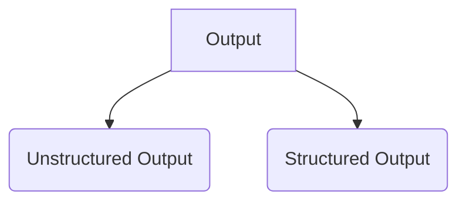
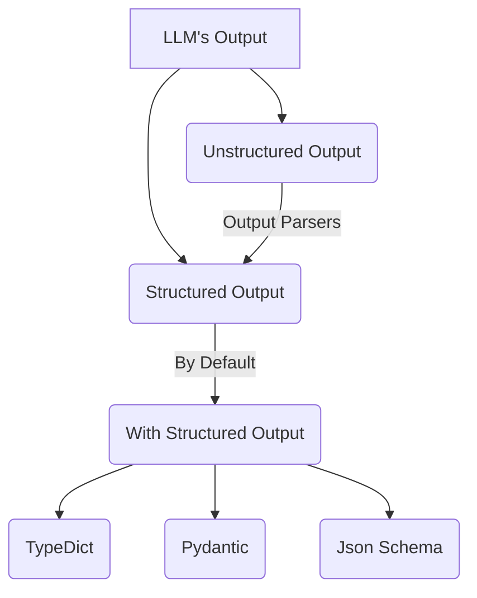

#### Notebook

```mermaid
graph TD
    A[ Output] --> B(Unstructured Output)
    A --> C(Structured Output)
```

```mermaid
graph TD
    A[LLM's Output] --> B(Unstructured Output)
    A --> C(Structured Output)
    B --> |Output Parsers| C
    C --> |By Default| D(With Structured Output)
    D --> E(TypeDict)
    D --> F(Pydantic)
    D --> G(Json Schema)
```

#### Why do we need Structured Output?
- Data Extraction
- API Building
- Multi Agents

#### Resources